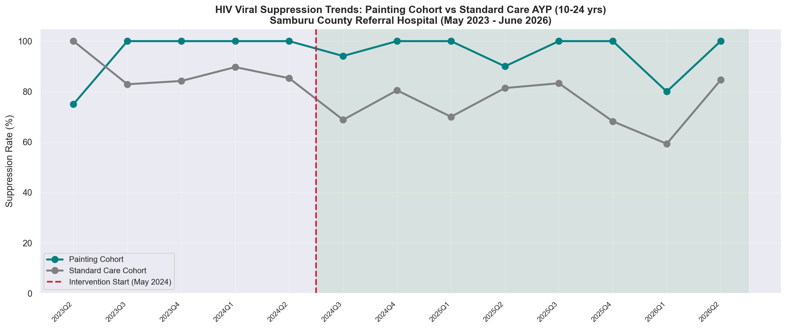
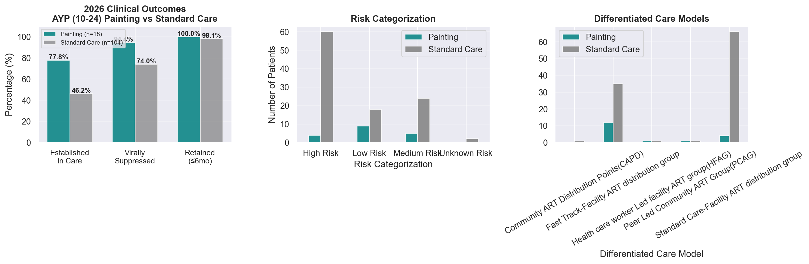
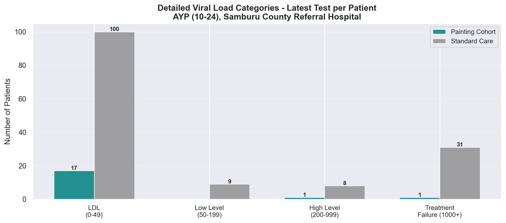

# 🎨 Art as Therapy: Can Painting Improve HIV Outcomes for Adolescents?

### A Differentiated Service Delivery (DSD) Model for AYP in Samburu, Kenya

[](https://www.python.org/)
[](LICENSE)
[](https://www.iasociety.org/)

**Author:** Victor Cheptumo — Biomedical Scientist & Community Health Data Analyst, Samburu County, Kenya  
**Presented at:** IAS HIV Conference 2026, Rio de Janeiro  

---

## 📊 At a Glance

| Metric | 🎨 Painting Cohort | 🏥 Standard Care | Difference |
|--------|:---:|:---:|:---:|
| **Established in Care** | **77.8%** | 46.2% | **+31.6 pp** |
| **Viral Suppression (<200)** | **89.5%** | 73.6% | **+15.9 pp** |
| **Retention (visit ≤6mo)** | **100.0%** | 98.1% | +1.9 pp |

> 167 AYP (10–24 years) | May 2023 – June 2026 | Samburu County Referral Hospital (MFL 15126)

---

## 🧬 The Question

> *"Can monthly community painting sessions — a low-cost, creative, peer-supported intervention — improve HIV treatment outcomes for adolescents and young people compared to standard care alone?"*

Adolescents and Young People (AYP, 10–24) have the **lowest viral suppression rates** of any age group in Kenya. Stigma, mental health struggles, and treatment fatigue drive poor outcomes. Standard clinical care rarely addresses psychosocial needs.

In May 2024, we started monthly Saturday painting sessions at Samburu County Referral Hospital. Kids take their medication, get lab samples collected, and then paint — in a relaxed, stigma-free environment. This repo contains the first quantitative analysis of whether it works.

---

## 📁 Repository Structure

```
art-therapy-hiv-dsd-samburu/
│
├── README.md                          ← You are here
├── .gitignore                         ← Raw patient data excluded
│
├── networks/
│   └── samburu_art_therapy_dsd_model.ipynb   ← Full analysis notebook
│
├── slides/
│   ├── chart1_suppression_trends.png          ← Quarterly trends (line chart)
│   ├── chart2_pre_post_comparison.png         ← Before/after intervention
│   ├── chart3_clinical_outcomes_dashboard.png ← Establishment, suppression, retention
│   └── chart4_vl_detailed_breakdown.png      ← Detailed VL categories
│
├── data/
│   └── processed/                     ← Anonymised CSVs (P-0001 IDs, no PII)
│       ├── samburu_dsd_anonymised_vl_data.csv
│       ├── samburu_dsd_latest_vl_per_patient.csv
│       └── samburu_dsd_linelist_summary.csv
│
└── scripts/                           ← Exploration & cohort analysis scripts
    ├── explore_data.py
    ├── cohort_analysis.py
    └── ...
```

> 🔒 **Raw patient data is NOT published.** Names, CCC numbers, DOBs, and facility identifiers are excluded. The `data/raw/` directory is gitignored.

---

## 🚀 Quick Start

```bash
# 1. Clone the repo
git clone https://github.com/victumo/art-therapy-hiv-dsd-samburu.git
cd art-therapy-hiv-dsd-samburu

# 2. Install dependencies
pip install pandas numpy matplotlib seaborn scipy openpyxl xlrd

# 3. Open the notebook
jupyter notebook networks/samburu_art_therapy_dsd_model.ipynb
```

> ⚠️ The notebook will look for raw data in `data/raw/` — you'll need access to the source files (not public). The processed anonymised CSVs in `data/processed/` are included and can be used directly.

---

## 📈 Key Findings

### 1. The Painting Cohort Stayed Suppressed Through a Crisis

Standard care AYP suppression **dropped from 88.2% to 75.7%** after the USAID funding freeze (2025). The painting cohort held steady at **~94%** throughout.



### 2. Painting Participants Are More Established in Care

**77.8%** of the painting cohort are classified as "Established" vs only **46.2%** of age-matched peers — a 31.6 percentage point gap.



### 3. Detailed Viral Load Breakdown

The painting cohort had **zero patients** in the Low Level Viremia (50–199) warning zone and only 1 in High Level Viremia (200–999), compared to 9 and 8 respectively in standard care.



---

## 🌍 Context: The USAID Funding Freeze (2025)

In early 2025, the USAID global funding freeze caused reagent stock-outs and clinic disruptions at SCRH. VL testing was interrupted and services only began recovering from late 2025. **This analysis shows how a low-cost, community-led intervention can buffer against health system shocks** — the painting sessions continued throughout.

---

## 🎯 Call to Action

This was a pilot with 26 participants. The evidence is directional, not definitive — but the magnitude of effect is clinically meaningful. We're seeking:

- **Formal DSD pilot** — Test the model in 3–5 additional sites
- **Operational research** — Optimal frequency, cost-effectiveness, integration into national guidelines
- **Partnerships** — Ministry of Health Kenya DSD technical working group, donors, IAS

---

## 🛠️ Tech Stack

| Tool | Purpose |
|------|---------|
| **Python** (pandas, numpy) | Data cleaning, transformation, aggregation |
| **Matplotlib + Seaborn** | All visualisations |
| **SciPy** | Chi-square statistical testing |
| **Jupyter Notebook** | Literate programming — code + narrative |
| **Excel/CSV** | Source data from KenyaEMR |

---

## 🔒 Data Privacy

- All patient identifiers (names, CCC numbers, NUPI, DOB) are **removed** before export
- Processed datasets use anonymous IDs (`P-0001`, `P-0002`, etc.)
- Raw clinical data remains local and is **never published**
- Institutional permission obtained from Samburu County Referral Hospital

---

## 👤 About the Author

**Victor Cheptumo** is a Biomedical Scientist and Community Health Data Analyst at Samburu County Referral Hospital in northern Kenya. He runs the hospital's viral load testing program and founded the Saturday painting initiative that grew from teaching kids basic computer skills into a community-led DSD intervention.

- 📧 GitHub: [@victumo](https://github.com/victumo)
- 🏥 Samburu County Referral Hospital, Maralal (MFL 15126)

---

## 📄 License

MIT — see [LICENSE](LICENSE) file.

---

> *"This isn't about computers anymore. It's about proving that creative, community-led interventions can keep adolescents in care — even when the system fails."*
